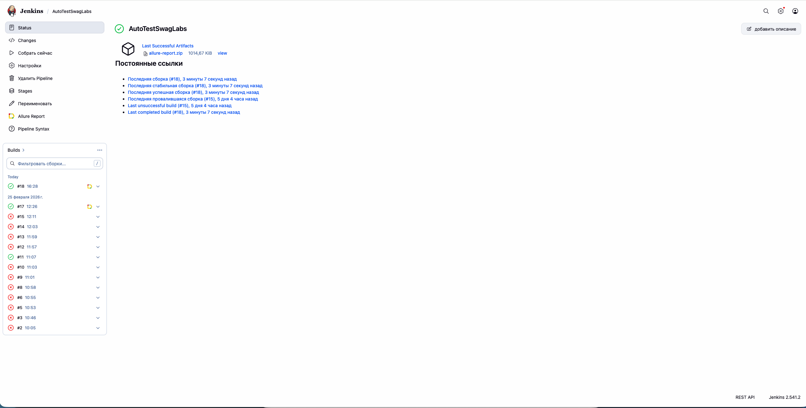
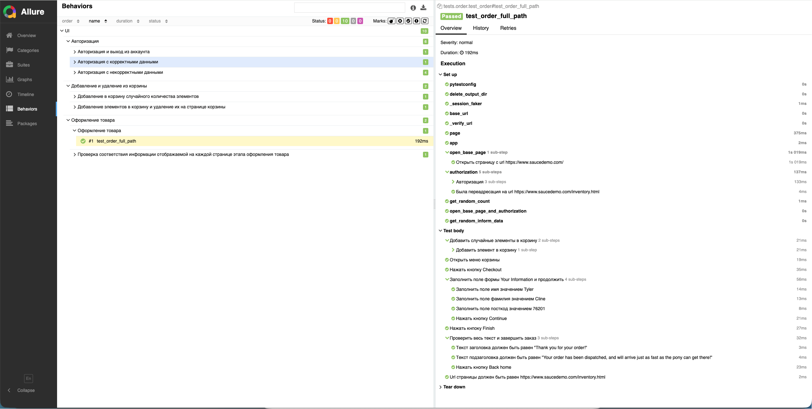

# Автотесты для сайта https://www.saucedemo.com

### Стек - playwright, python
### Патерны - Page object, fixture, allure, faker

### Всего было создано 10 автотестов затрагивающие основной функционал сайта, в том числе e2e. В основном реализованы позитивные сценарии.

### Все тесты приближены к реальным, присутствуют проверки, используются исключительно случайные значения и случайные количества

## Список всех тестов

### Авторизация
- Авторизация с корректными данными
- Авторизация с некорректными данными:
  - Заблокированный пользователь
  - Пользователь не найден
  - Пароль не введен
  - Логин не введен
- Авторизация и выход из аккаунта

### Оформление товара
- Добавление в корзину случайного количества элементов
- Добавление элементов в корзину и удаление их на странице корзины
- Оформление товара
- Проверка соответствия информации отображаемой на каждой странице этапа оформления товара

## Запуск тестов

### Установка зависимостей (использовался питон 3.10)

```
pip install -r requirements.txt
```

### Запуск автотестов с использованием allure и открытие страницы отчетов
```
pytest --alluredir=allure-results && allure serve allure-results
```

## Jenkins

### Для проекта был поднят локальный Дженкинс, файл скрипта находится в корне, полностью рабочий, тесты выполняются, отчет генерируется



